# TSL语言学习笔记

## python

### 头文件

import pyTSL

from pyTSL.Const import *

from datetime import datetime


### 登入和登出

c = pyTSL.Client("hit", "20230427", "tsl.tinysoft.com.cn", 443)

c.login()

c.logout()

### 字段表

#### 日期类

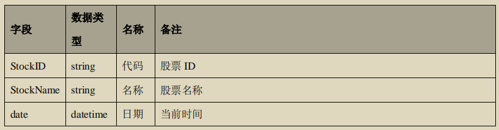

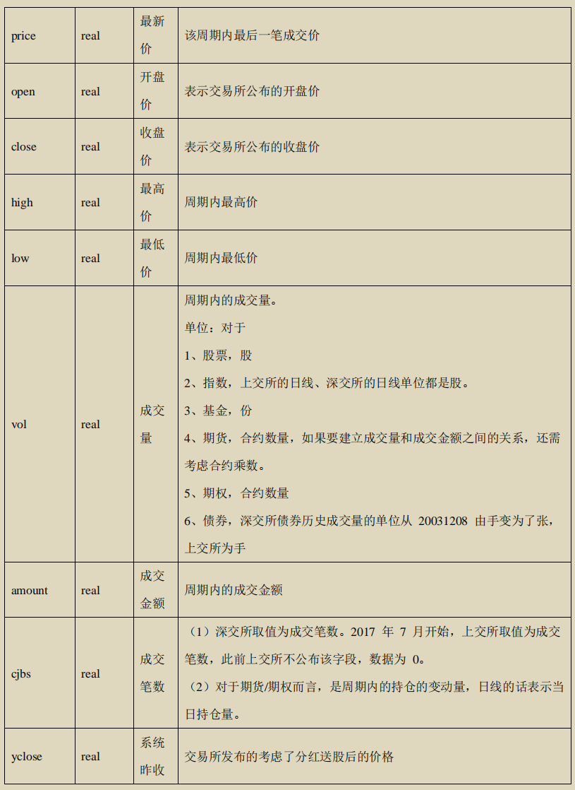mm

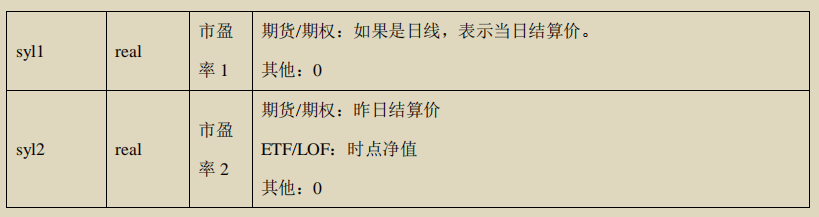

#### 其他类

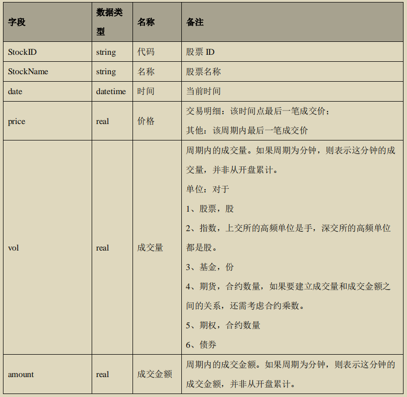

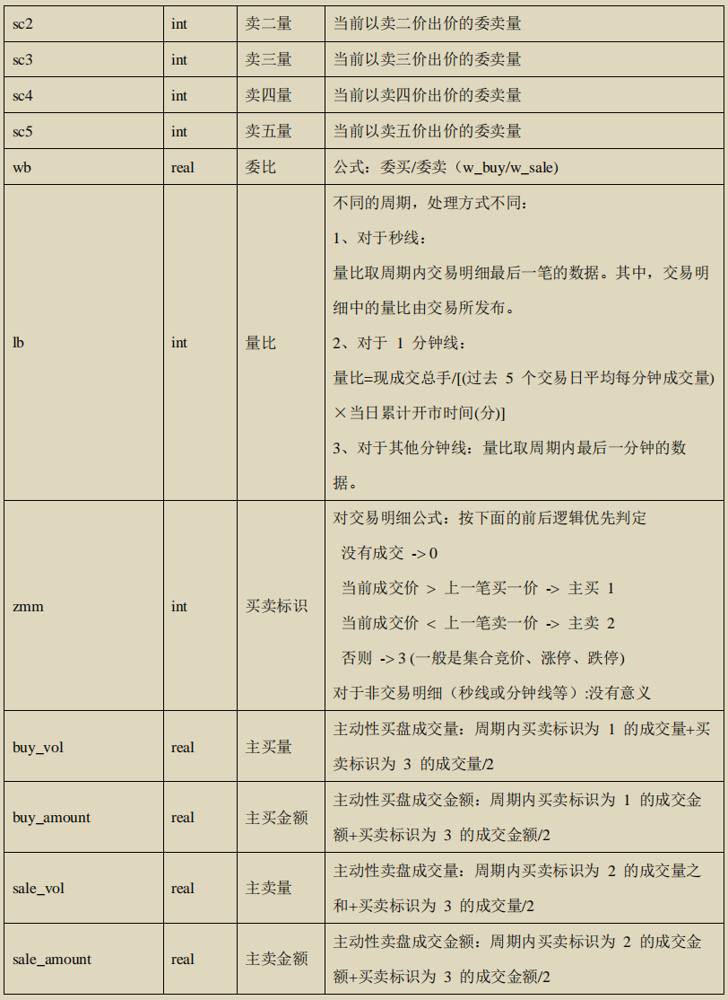

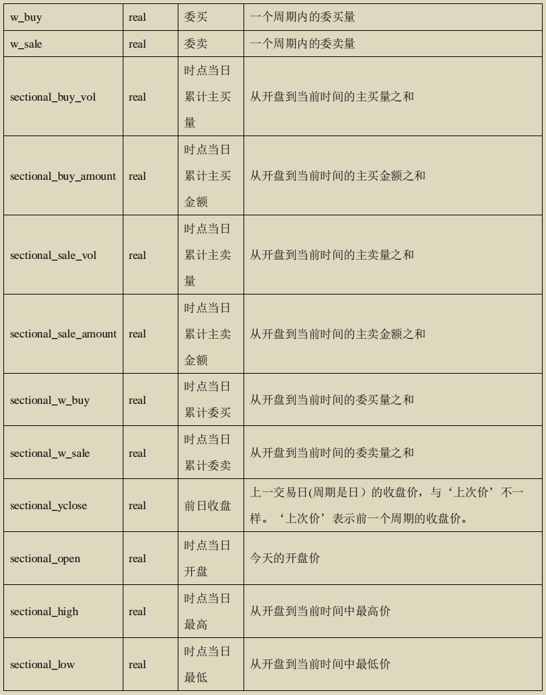

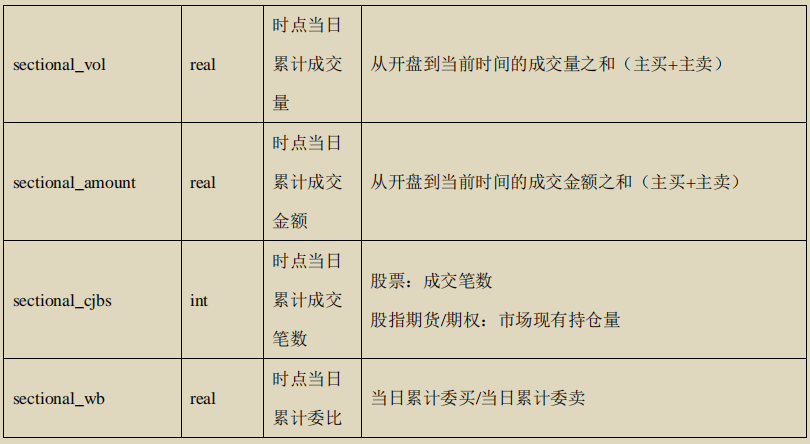

### pyTSL.Const模块

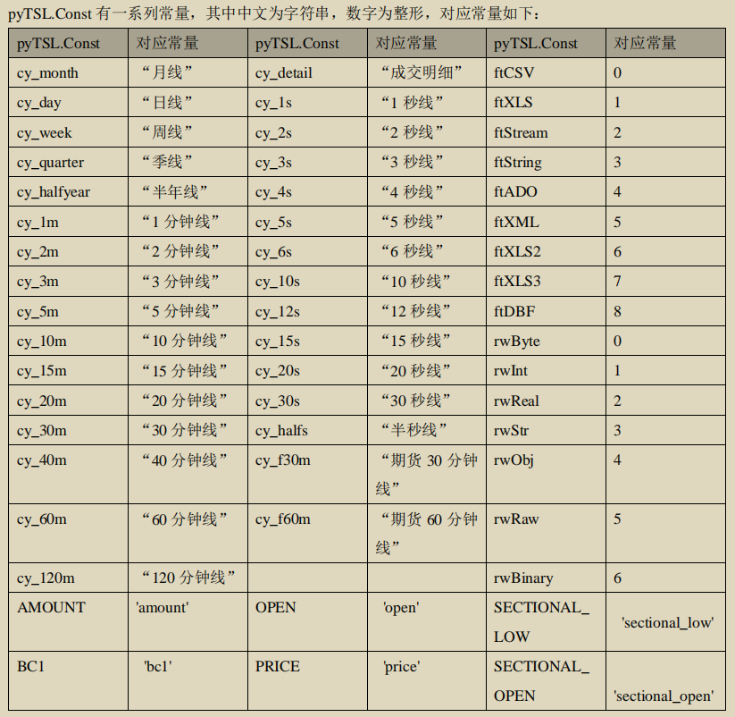

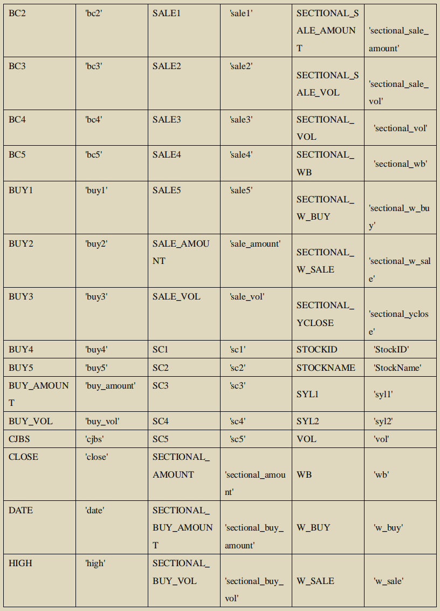

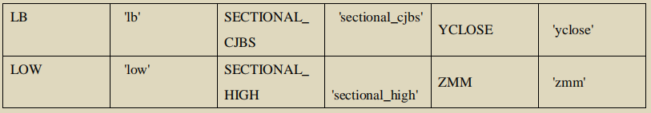

### exec(code, **kwargs): TSReturnValue

执行一段TSL代码

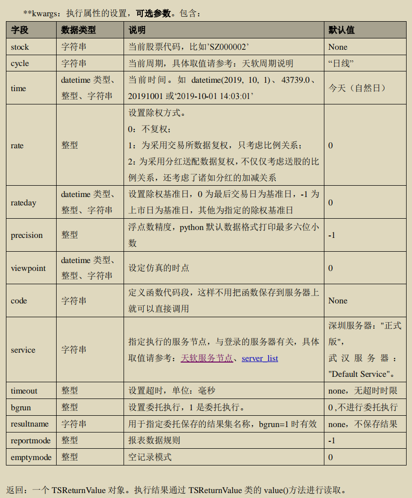


### call(funcname, *args, **kwargs) : TSReturnValue

函数说明：调用函数并返回结果

其中func为TSL函数， args内容为**funcname**的函数参数，可输入如下类型数据

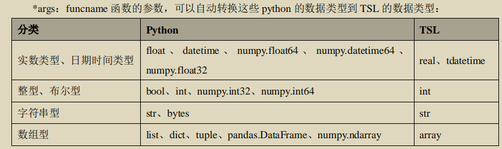

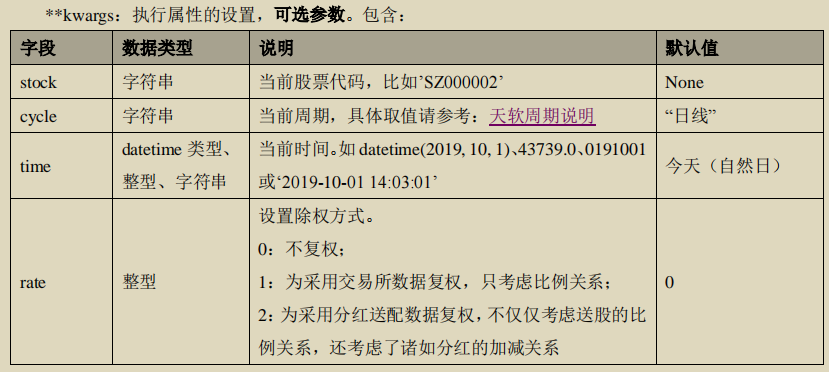

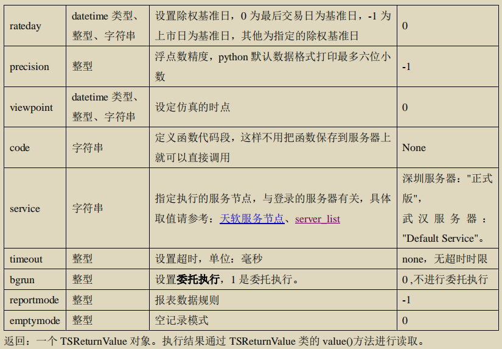

这里code为TSL的code，即可通过自己定义TSL的function并执行

### query(**kwargs): TSReturnValue

查询行情数据

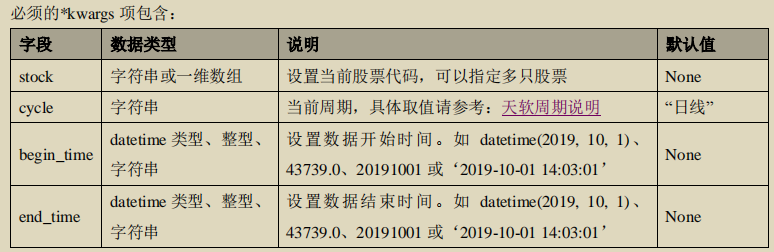

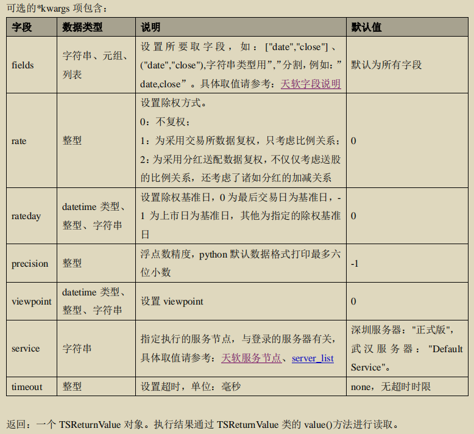

### list_bgrun

列出所有委托执行

c.list_bgrun()

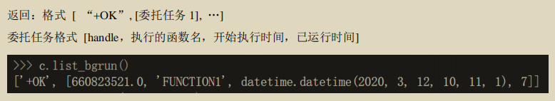

### stop_bgrun(handle)

停止委托任务

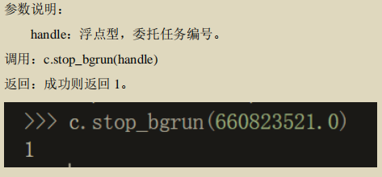

### admin(**kwargs)

执行天软客户端任务管理命令


### set_callback(function)

设置回调函数，使用的时候为 rdo2 mypycallback

```
def aasd(*args):
    print(*args)
    return 1
c.set_callback(aasd)
c.exec('''a := rdo mypycallback('ok'); echo a;'''); #rdo 会被调用，打印出 mypycallback "ok"

```


### 格式转换

**DatetimeToDouble(datetime)**

函数说明：将时间从 Python 的 datetime 类型转换到 TSL 的时间类型，时间精度到毫秒。

参数说明：datetime：datetime 类型，时间。

返回：转换后得到的 TSL 时间类型的时间

调用：pyTSL.DatetimeToDouble(datetime)

**DoubleToDatetime(t)**

函数说明：将时间从 TSL 的时间类型转换到 Python 的 datetime 类型，时间精度到毫秒。

参数说明：t：TSL 时间类型 Tdatetime，时间。

返回：转换后得到的 datetime 类型的时间


### TSBatch类

用于并发执行多个天软任务。可利用函数key来标识每个任务，字符串参数可用format函数进行配置

**batchs = pyTSL.Batch(5)**

构造对象

**batchs.id()**

返回任务id

**batchs.key()**

返回任务关键字信息

**batchs.exec(client, code, *kwargs)**

**batchs.call(client, functionname, *args, *kwargs)**

**batchs.query(*kwargs)**


## TSL

### function写法

```
function name(arg1, arg2);
begin
	n:=tradedays(inttodate(begt),inttodate(endt));//时间段内交易日数
    return nday(n,'date',datetostr(sp_time()),'vol',vol(),'amount',amount());
end;
```

### 函数整理

#### 股票

获取当前最新的A股所有股票代码序列 getbk('A股')

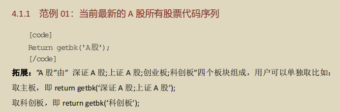

getbk()函数可以获得任意板块下的内容， 如“上市基金”， “已退市基金”

获取指定日期下的A股代码序列 getAbkbydate('A股', 20200210T)

获取指定日期下的指数成份股的代码序列 getbkbydate("SH0000300", 20210107T)

#### 基金

getbk()

FundOperateFundsbyBkname (bkName,EndT)：指定日指定基金板块中还在运作的基金

FundsOperateFunds(funds,EndT)：指定日指定基金序列中还在运作的基金

getbkall()

#### 债券

CB_GetTradeMarkByDate(EndT); 指定日在市的可转债

BondConvertibleBonds2(); 取所有的可转债

#### 期货

FuturesIsTrade(EndT); 判断当前期货合约在指定日是否在交易期间

GetFuturesID('IF', EndT); 返回指定日期还能交易的期货代码

#### 期权

OP_GetOptionChain('SH510050',20210403T); 指定品种在指定日在市交易的期权合约

 OP_GetUnderlyingSecurity(); 所有已上市的期权标的代码或标的品种

### 行情数据提取

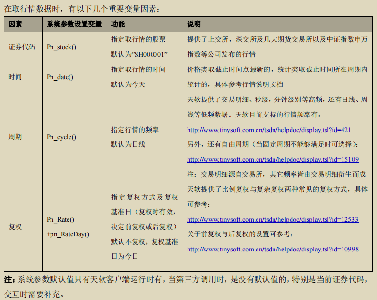

#### nday用法

使用setsysparam()设置搜索范围

```
  endt:=20210713T;
  N:=7;//或当已知的是begt时，可用N:=tradedays(begt,endt);来计算N
  setsysparam(pn_stock(),'SH600000');//设置当前证券代码：取SH600000的数据
  setsysparam(pn_date(),endt);//设置nday推移的截止日
  ret2:=nday(N,'时间1',datetimetostr(sp_time()),//当前时间-sp_time()
   //当指定日是参数时，用sp_time()替代，表示前当前时间
   'close1',stockclose(sp_time()),
   'c1',close());
  return ret2;
```


#### Tradetable 交易明细

**Select语法**

Select ['字段名 1'],['字段名 2'],.../*

from Tradetable Datekey 开始时间 to 截止时间

of stockid/array(stockid1,stockid2,...)

where 条件

end;

注:其中，where 条件可省；开始时间与截止时间需精确到时间点


## 任务需求

### 1.了解天软数据库，阅读基本文档

a) 天软数据文档参考网址：http://www.tinysoft.com.cn/tsdn/helpdoc/index.tsl?itemid=31485

b) 天软账号: hit, 密码: 20230427

c) 附件里面的数据api相关文档

### 2.了解基础金融知识（附件有不分基础知识材料）

a) 什么是指数

b) 什么是期货

> 期货是一种标准化金融合同，允许买方和卖方在未来的某个特定日期以协商好的价格购买或出售一定数量的标的资产。这些标的资产可以包括商品（如原油、黄金、小麦等）、金融工具（如股票、债券、外汇）或市场指数。
>
> 期货合同中包括了以下关键元素：
>
> 1. **标的资产：** 这是期货合同所涉及的具体资产，可以是任何东西，从大宗商品到金融指数等。标的资产的种类取决于期货合同的类型。
> 2. **交割日期：** 这是合同规定的未来日期，也是买方和卖方约定执行合同的日期。
> 3. **合同大小：** 这是合同规定的标的资产数量。例如，一个标普500指数期货合同可能代表指数价值的一定倍数。
> 4. **价格：** 这是买方和卖方约定的合同价格，也称为期货价格。它代表了在交割日期时买卖标的资产的价格。
>
> 期货合同的主要用途包括：
>
> - **套保（Hedging）：** 投资者可以使用期货合同来对冲未来价格波动的风险。例如，农民可以使用小麦期货合同来锁定未来的销售价格，以应对市场价格下跌的风险。
> - **投机（Speculation）：** 投资者可以购买或卖空期货合同，以赚取价格变动的差价，而无需拥有实际的标的资产。这是一种赚取市场波动利润的方式。
> - **定价（Price Discovery）：** 期货市场上的交易可以为标的资产提供价格发现机制，有助于市场参与者了解市场对标的资产的预期价值。
>
> 期货市场通常具有高度流动性，允许交易者在市场上快速买入或卖出合同。然而，期货交易也涉及高度杠杆，可能带来潜在的风险，因此需要谨慎管理和风险管理。期货交易通常由交易所进行监管，以确保合同的履行。
>
> 
>
> 期货是一种金融工具，涵盖多个不同的市场和资产类别。以下是一些常见的期货合约类型：
>
> 1. **商品期货：** 这包括农产品（如小麦、大豆、棉花、咖啡）、能源商品（如原油、天然气）、金属商品（如黄金、铜）和其他商品。商品期货合约通常跟踪这些商品的价格。
> 2. **金融期货：** 这包括股指期货（如标准普尔500指数期货、道琼斯指数期货）、利率期货（如美国国债期货、欧元利率期货）、外汇期货（如欧元兑美元期货）等。金融期货合约通常涉及金融市场指数、汇率或利率。
> 3. **股票期货：** 股票期货合约允许交易者投机或套保股票市场表现。这些合约通常以特定公司的股票为标的，例如标普500指数股票期货。
> 4. **利率期货：** 利率期货合约涉及到债券或其他债务证券的利率。这些合约常被用于套保或投机利率走势。
> 5. **外汇期货：** 外汇期货合约涉及不同货币之间的汇率。这种合约允许交易者对汇率波动进行套保或投机。
> 6. **股指期货：** 股指期货合约是股票市场指数的衍生品。它们允许投资者对整个市场的表现进行投机或套保。
> 7. **虚拟货币期货：** 这包括比特币期货等数字货币期货合约。虚拟货币期货是对加密货币价格的投机工具。
> 8. **肉类期货：** 肉类期货合约通常涉及牛肉、猪肉、鸡肉等肉类产品的价格。
>
> 这些是期货市场中的一些主要合约类型。每个市场都有自己的规则和合约，投资者可以选择根据其投资目标和风险偏好来交易不同类型的期货。期货市场为投资者提供了多样化的工具，以对冲风险、实现投机目标或参与不同市场的机会。

c) 什么是期权

d) 什么是tick数据

> Tick数据通常用于描述金融市场中某个交易品种（如股票、期货、外汇等）的最小价格变动。每一个价格变动都被称为一个"tick"。Tick数据显示了市场中的每次价格变动、成交量和时间戳，它是分时价格和成交数据的最基本形式。
>
> 以下是一些关于Tick数据的关键特点：
>
> 1. **最小价格变动：** Tick是最小的价格变动单位。它可以是股票价格的最小变动，如一分钱，或期货价格的最小变动，如0.01美元。
> 2. **成交价和成交量：** 每个Tick通常包括成交价格和成交量。成交价是该Tick发生交易的具体价格，成交量是在该价格上的交易数量。
> 3. **时间戳：** Tick数据还包括了交易发生的确切时间，通常精确到毫秒级别。
> 4. **用途：** Tick数据对于高频交易策略和短期交易者非常重要，因为它提供了市场价格变动的详细信息。长期投资者通常更关注日线或分钟线数据。
> 5. **数据获取：** Tick数据通常来自金融交易所，市场数据提供商或经纪商。它可以用于分析市场走势、制定交易策略以及执行算法交易。
> 6. **分析：** 分析Tick数据可以揭示市场中的价格趋势、交易活动和流动性情况。交易者使用这些数据来制定交易策略，识别支撑和阻力水平，以及确定市场潜在的买入或卖出信号。
>
> 总之，Tick数据是金融市场中的基本数据形式，对于那些需要高频交易或者对市场价格波动非常敏感的交易者来说，它是无价的信息源。它提供了更高精度的价格和成交信息，以帮助交易者做出决策。
>
> 
>
> Tick数据通常包括以下几个主要细分数据：
>
> 1. **时间戳（Timestamp）：** 这是Tick数据的时间标签，表示每个Tick的具体时间。通常以日期和时间的形式呈现，可以精确到毫秒级别。
> 2. **成交价格（Price）：** 表示每个Tick的成交价格。这是股票、期货、外汇或其他资产的价格。价格通常以小数点后若干位的精度表示。
> 3. **成交量（Volume）：** 每个Tick中包含的成交数量。成交量表示在该价格上进行的交易数量。
> 4. **市场深度（Market Depth）：** 对于某些金融工具（如股票和期货），Tick数据还可以包括市场深度信息，即买盘和卖盘的报价和数量。这些数据通常以多个级别的深度表现，反映了市场上的买入和卖出兴趣。
> 5. **成交方向（Trade Direction）：** 每个Tick的成交方向，即是卖出（卖盘）还是买入（买盘）。
> 6. **开盘价（Open）和收盘价（Close）：** 对于某些Tick数据，尤其是在股票市场中，可能包括每个Tick的开盘价和收盘价。这些价格通常用于绘制K线图表。
> 7. **最高价（High）和最低价（Low）：** 一些Tick数据也包括每个Tick的最高价格和最低价格，用于确定一定时段内价格的波动范围。
> 8. **增量价格（Price Change）：** 记录每个Tick相对于前一个Tick的价格变动。
> 9. **增量成交量（Volume Change）：** 记录每个Tick相对于前一个Tick的成交量变动。
> 10. **交易所或市场标识符：** 指示每个Tick数据来自哪个交易所或市场的标识符。这对于多市场交易者非常重要。

e) 什么是k线

> K线（K-line）是股票、期货、外汇等金融市场中常见的一种价格图表，它以时间为横轴，以价格走势为纵轴，用不同的蜡烛形状和线段表示价格的波动情况。K线图主要包括四个价格点：开盘价（Open）、收盘价（Close）、最高价（High）、最低价（Low）。
>
> K线的基本元素是蜡烛（candlestick），每个蜡烛代表一段时间（如1分钟、5分钟、日、周等），蜡烛的上下影线表示最高价和最低价之间的价格波动，蜡烛的实体表示开盘价和收盘价之间的价格波动。不同颜色的蜡烛代表价格上涨（一般为白或绿色）和价格下跌（一般为黑或红色）。
>
> K线图常用于分析价格走势，特别是在技术分析中。通过观察K线图的不同形态和模式，分析师和交易员可以尝试预测未来价格的变动趋势。一些常见的K线图模式包括乌云盖顶、锤头线、吞噬形态等，它们有助于制定买入和卖出的决策策略。
>
> K线图不仅在股票市场中使用广泛，还在期货、外汇和加密货币市场等领域得到广泛应用。它是一种强大的工具，可以帮助交易员更好地理解市场行为和价格趋势。
>
> 
>
> K线图通常包括以下几种主要数据：
>
> 1. **开盘价（Open）：** K线图中每个蜡烛的实体的底部代表开盘价，它是该时间段内的第一笔交易价格。
> 2. **收盘价（Close）：** K线图中每个蜡烛的实体的顶部代表收盘价，它是该时间段内的最后一笔交易价格。
> 3. **最高价（High）：** K线图中每个蜡烛的上影线（或蜡烛实体的顶部）代表最高价，即该时间段内的最高交易价格。
> 4. **最低价（Low）：** K线图中每个蜡烛的下影线（或蜡烛实体的底部）代表最低价，即该时间段内的最低交易价格。
>
> 这些是K线图的基本数据。通过这些数据，你可以了解每个时间段内的价格波动情况，包括开盘价、收盘价、最高价和最低价。不同时间段的K线图反映了不同时间间隔内的价格走势，例如分钟K线、日K线、周K线等。根据这些数据，你可以进行技术分析，制定交易策略。此外，K线图中还有一些其他指标，如成交量柱状图、均线等，用于更全面地分析市场情况。


### 3.下载指定数据表

a) 期货

i. 获取某日某期货的tick行情

ii. 获取某日某期货的分钟线行情

iii. 获取某日所有当日在交易的期货合约

iv. 获取某个品种所有期货合约

v. 获取期货合约信息表

b) 期权

i. 获取某日某期权的tick行情

ii. 获取某日某期权的分钟线行情

iii. 获取某日所有当日在交易的期权合约

iv. 获取某个标的的所有期权合约

v. 获取期权合约信息表

c) 股票

i. 获取某日某只股票的tick行情

ii. 获取某日某只股票的分钟线行情

iii. 获取所有股票代码

d) 指数

i. 获取某日指数成分股列表

### 4.下载连续数据并存在本地

a) 期货

b) 期权

c) 股票

d) 指数

 